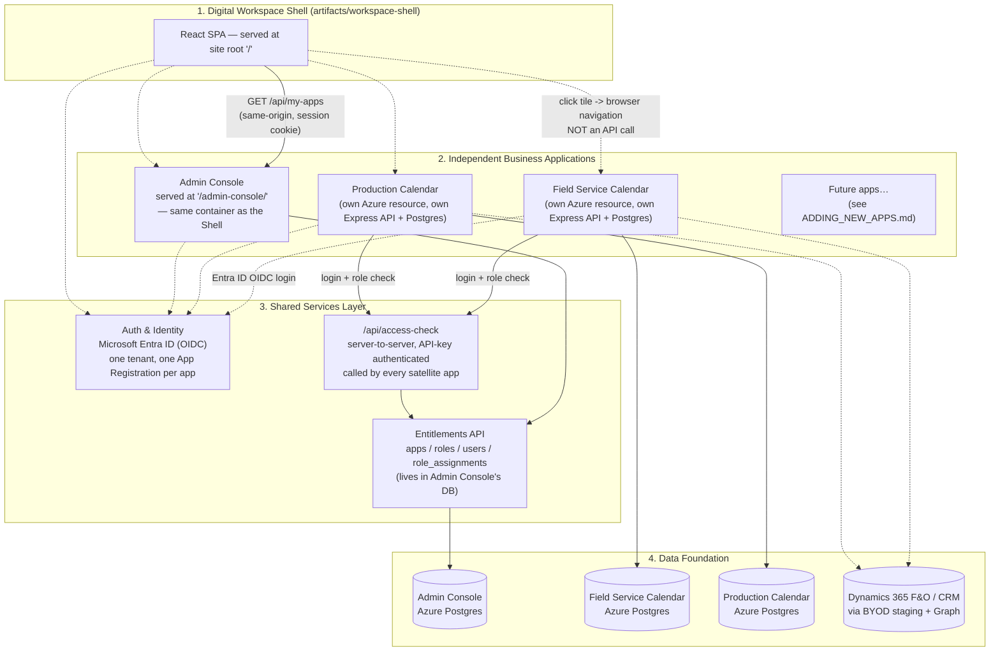
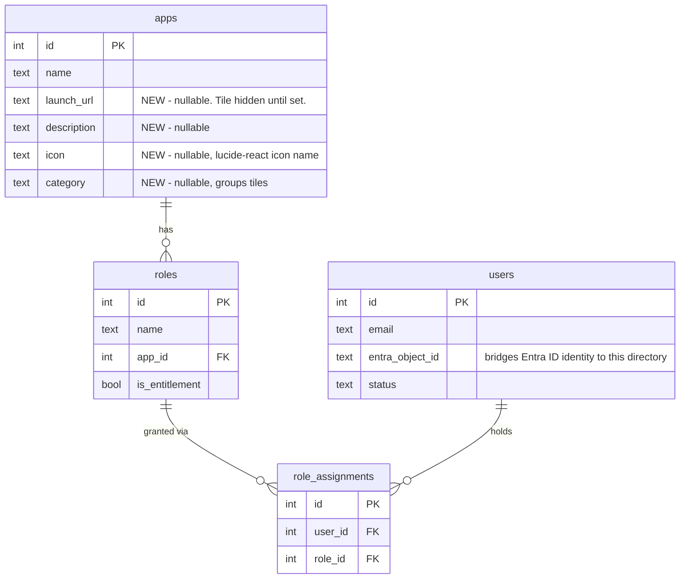
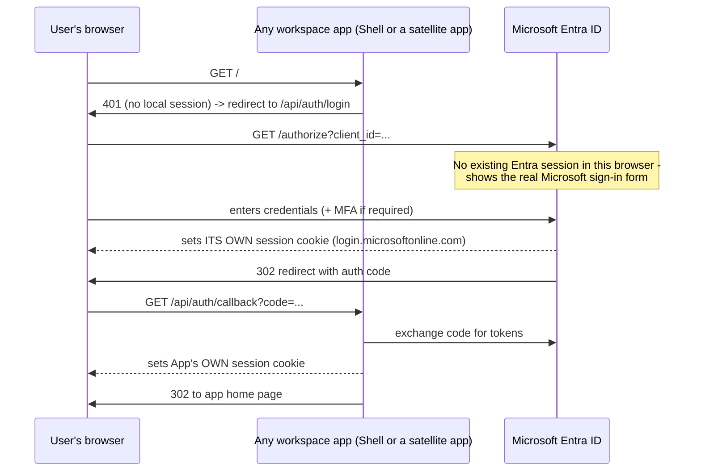
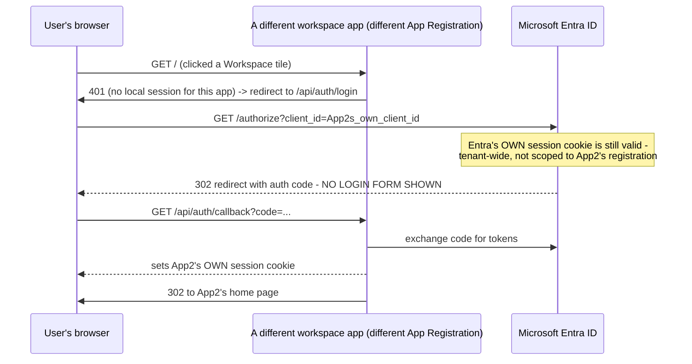
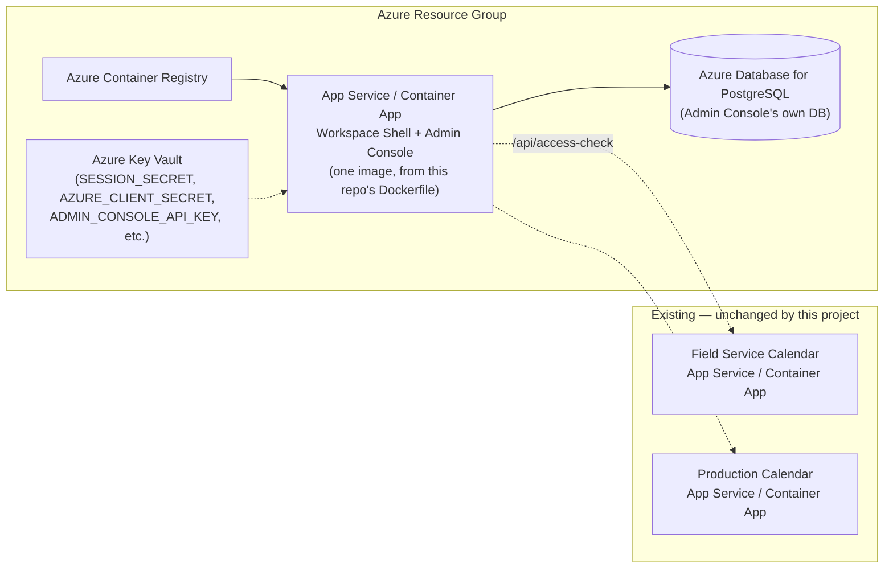

# Digital Workspace — Technical Design & Implementation

**Status:** Implemented and verified — see §9 "What was actually verified"
for exactly what was tested and how, versus what's a documented design
decision not yet exercised in production.

## 1. Architecture overview



**Key design decision:** the Digital Workspace Shell is a *thin, additive*
layer on top of infrastructure that already existed in this workspace. The
Admin Console already was the "Shared Services Layer → Auth & Identity /
Entitlements" component in the reference architecture — Field Service
Calendar and Production Calendar already call its `/api/access-check`
endpoint to authorize their own users. Building the Shell meant:

1. Adding four nullable columns to the existing `apps` table
   (`launch_url`, `description`, `icon`, `category`).
2. Adding one new authenticated endpoint, `GET /api/my-apps`, that reuses
   the exact same entitlement model every satellite app already checks
   against.
3. Adding one new frontend (`artifacts/workspace-shell`) that calls it.
4. Moving the Admin Console's own UI from the site root to `/admin-console/`
   so the Shell can own the root — the Admin Console is now presented *as
   one of the tiles*, matching "Admin / Configuration" in the reference
   architecture, rather than being a separate front door.

No new identity system, no new entitlement system, and (critically, see §3)
**no new SSO mechanism** were built — all three already existed or come for
free from using Entra ID consistently.

## 2. Data model

The entitlement model is unchanged from the existing Admin Console schema —
only additive columns were introduced on `apps`:



`lib/db/src/schema/apps.ts`:

```ts
export const appsTable = pgTable(
  "apps",
  {
    id: serial("id").primaryKey(),
    name: text("name").notNull().unique(),
    // --- Workspace Shell fields (all nullable — an app simply doesn't
    // appear as a tile until launchUrl is set; existing CRUD flows for
    // "apps" keep working unmodified).
    launchUrl: text("launch_url"),
    description: text("description"),
    icon: text("icon"),       // lucide-react icon name, validated client-side
    category: text("category"), // free-text grouping label for the shell
  },
  (t) => [uniqueIndex("apps_name_lower_unique").on(sql`lower(${t.name})`)],
);
```

Applied with `drizzle-kit push` — no destructive migration, purely additive,
safe to run against a database that already has data.

## 3. Single sign-on design

This is the part worth understanding precisely, because it's easy to
over-build (a custom shared-session/SSO token system) when the pieces
already in this workspace get you there for free.

### 3.1 What already existed

Every app in this workspace (Field Service Calendar, Production Calendar,
Admin Console) already implements the **same OIDC login flow** against
**Microsoft Entra ID**:

```
GET  /api/auth/login     -> redirects to Entra ID's authorize endpoint
GET  /api/auth/callback  -> exchanges the auth code, establishes a local
                             session (own cookie, own session store)
GET  /api/auth/me        -> returns the current session's user, or 401
POST /api/auth/logout    -> destroys the LOCAL session only
```

Each app has **its own Azure App Registration** (its own `CLIENT_ID`), its
own session cookie, and its own session store. These are genuinely separate
sessions — there is no shared cookie and no shared session store across
apps, by design (keeps every app's deployment independent).

### 3.2 The mechanism that makes re-login unnecessary

Microsoft Entra ID itself maintains **a single sign-in session in the
user's browser, scoped to the tenant** — independent of which application's
App Registration triggered the sign-in. This is standard OIDC/Entra ID
behavior, not something custom-built for this project.

Sequence for the first app a user ever opens in a session:



Sequence for the **second** app the same user opens, in the same browser
session:



**The user only ever sees a login form once per Entra ID session
lifetime** (subject to the tenant's own sign-in frequency policy, MFA
policy, and conditional access rules — those are controlled entirely in
Entra ID, not by this workspace). Every subsequent app redirects through
Entra ID and back in well under a second, with no visible interruption.

### 3.3 What this depends on (read before assuming it "just works")

| Requirement | Why | Where to check/fix it |
|---|---|---|
| All app registrations are in the **same Entra ID tenant** | Entra's SSO session is tenant-scoped. Two apps registered in different tenants will never share SSO, full stop. | Azure Portal -> Entra ID -> App registrations. Confirm every satellite app's `TENANT_ID`/`ENTRA_TENANT_ID` env var is identical. |
| **Admin consent** is granted for each app's required scopes | Without it, the *first* time a user opens a given app, Entra ID shows a one-time "Accept" consent screen — which looks like a login prompt even though credentials aren't re-entered. | Azure Portal -> Entra ID -> App registrations -> (each app) -> API permissions -> "Grant admin consent for `<tenant>`". |
| The browser isn't in a private/incognito window or blocking cookies aggressively | Entra's own session cookie has to persist across the redirect round trips. | Standard browser behavior; flagging only because it's the one environment factor outside this project's control. |
| The user's Entra ID session hasn't expired or been revoked (sign-in frequency policy, conditional access, admin-forced sign-out) | If it has, the redirect to Entra ID **will** show a real login form again — this is correct, expected behavior, not a bug in this design. | Tenant-level policy, set by the organization's identity team, independent of this project. |

### 3.4 What single sign-on does *not* cover

- **Signing out of the Shell does not sign the user out of satellite apps.**
  Each app's `/api/auth/logout` only destroys *that app's own* session.
  A true "sign out everywhere" would require either (a) each app calling
  Entra ID's own `end_session_endpoint` (front-channel or back-channel
  logout — Entra ID supports this, but every app would need to register a
  logout callback URL and implement the receiving endpoint), or (b) the
  Shell explicitly telling each app to log out via a hidden iframe/redirect
  chain on sign-out. **Neither was built in this phase** — call this out
  explicitly to stakeholders if "sign out everywhere" is a hard requirement,
  since it's real, non-trivial additional work, not an oversight.
- **This is not a shared session.** If Entra ID's session is still valid but
  App B's *own* session has separately expired (e.g. a shorter session
  cookie `maxAge`), the user goes through the silent Entra redirect again
  (imperceptible) to re-establish App B's session — this is normal and by
  design, not a failure.

## 4. The `GET /api/my-apps` endpoint

`artifacts/api-server/src/routes/myApps.ts` (Admin Console's API server):

```ts
import { Router, type IRouter } from "express";
import { eq, and, isNotNull } from "drizzle-orm";
import { db, usersTable, roleAssignmentsTable, rolesTable, appsTable } from "@workspace/db";
import { GetMyAppsResponse } from "@workspace/api-zod";

const router: IRouter = Router();

router.get("/my-apps", async (req, res): Promise<void> => {
  const sessionUser = req.session.user;
  if (!sessionUser) {
    res.status(401).json({ error: "Not signed in" });
    return;
  }

  // IMPORTANT: the Shell's login session (appUsersTable, keyed by an
  // internal id) and the entitlement directory (usersTable, keyed by
  // entraObjectId) are two DIFFERENT tables for two different purposes.
  // Bridge them by entraObjectId — the same bridge accessCheck.ts already
  // uses for every satellite app's access checks.
  const [directoryUser] = await db
    .select({ id: usersTable.id, name: usersTable.name, status: usersTable.status })
    .from(usersTable)
    .where(eq(usersTable.entraObjectId, sessionUser.entraObjectId));

  if (!directoryUser || directoryUser.status !== "active") {
    // Not an error — a signed-in user with no directory entitlement yet is
    // a legitimate, expected state. Empty list, not a 4xx/5xx.
    res.json(GetMyAppsResponse.parse({ userName: sessionUser.name, apps: [] }));
    return;
  }

  const rows = await db
    .selectDistinct({
      id: appsTable.id, name: appsTable.name, description: appsTable.description,
      icon: appsTable.icon, category: appsTable.category, launchUrl: appsTable.launchUrl,
    })
    .from(roleAssignmentsTable)
    .innerJoin(rolesTable, eq(roleAssignmentsTable.roleId, rolesTable.id))
    .innerJoin(appsTable, eq(rolesTable.appId, appsTable.id))
    .where(
      and(
        eq(roleAssignmentsTable.userId, directoryUser.id),
        isNotNull(appsTable.launchUrl), // no launch URL, no tile
      ),
    )
    .orderBy(appsTable.category, appsTable.name);

  res.json(GetMyAppsResponse.parse({
    userName: directoryUser.name,
    apps: rows.map((r) => ({ ...r, launchUrl: r.launchUrl! })),
  }));
});

export default router;
```

Mounted in `routes/index.ts` **after** `requireAuth`, alongside every other
authenticated route — no special-casing.

### API contract (OpenAPI, `lib/api-spec/openapi.yaml`)

```yaml
/my-apps:
  get:
    operationId: getMyApps
    responses:
      "200":
        content:
          application/json:
            schema:
              $ref: "#/components/schemas/MyAppsResponse"
      "401":
        description: Not signed in
```

The Zod runtime schemas and TypeScript types (`MyApp`, `MyAppsResponse`,
`GetMyAppsResponse`) are generated from this spec via the existing `orval`
pipeline (`pnpm --filter @workspace/api-spec run codegen`) — they are not
hand-written, so the frontend and backend can never silently drift out of
sync on this contract.

## 5. The Workspace Shell frontend

`artifacts/workspace-shell` — a standalone Vite + React app, deliberately
lean (no shared design system dependency): a login-gated shell that fetches
`/api/my-apps` and renders grouped, searchable tiles.

```
artifacts/workspace-shell/
  src/
    App.tsx           — auth gate: checks /api/auth/me, shows Landing or Workspace
    pages/
      Landing.tsx      — login screen (identical /api/auth/login flow as every app)
      Workspace.tsx    — the tile launcher: search, category grouping, empty/error states
    lib/
      icons.ts         — safe string->icon component registry (see §6)
```

Core of `Workspace.tsx` (tile launch is plain browser navigation, not an
API call — the target app is a fully separate origin):

```tsx
function launch(url: string) {
  window.open(url, "_blank", "noopener,noreferrer");
}

function AppTile({ app }: { app: MyApp }) {
  const Icon = resolveIcon(app.icon);
  return (
    <button onClick={() => launch(app.launchUrl)} className="...">
      <Icon className="h-5.5 w-5.5" />
      <div className="font-semibold">{app.name}</div>
      {app.description && <div className="text-sm text-slate-500">{app.description}</div>}
    </button>
  );
}
```

## 6. Icon handling

An app's icon is stored as a plain string (`apps.icon`), not a component
reference, because it's persisted data set through the Admin Console UI —
code can't be stored in a database column. `artifacts/workspace-shell/src/lib/icons.ts`
is the single place that maps known strings to real `lucide-react`
components, with a safe fallback so a typo or an icon name added on one side
but not the other never breaks a tile's rendering:

```ts
export const ICON_REGISTRY: Record<string, LucideIcon> = {
  Wrench, Factory, ShoppingCart, Package, BarChart3,
  Settings, Users, ClipboardList, Calendar, Truck,
  ShieldCheck, Database,
};

export function resolveIcon(name: string | null): LucideIcon {
  if (!name) return LayoutGrid;
  return ICON_REGISTRY[name] ?? LayoutGrid;
}
```

The Admin Console's tile-editing UI (`WorkspaceTilesSection.tsx`) offers a
dropdown constrained to exactly this same list, so an administrator can
never pick a name that won't render — see `ADDING_NEW_APPS.md` for what to
do when a new app needs an icon not yet in this list.

## 7. Serving both frontends from one container

`artifacts/api-server/src/app.ts` (extending the same `STATIC_ROOT_DIR`
multi-frontend pattern already used elsewhere in this project's app family):

```ts
const staticRootDir = process.env.STATIC_ROOT_DIR;
if (staticRootDir) {
  const resolvedRoot = path.resolve(staticRootDir);

  // Mount admin-console's subpath FIRST — it must be matched before
  // workspace-shell's root catch-all, since Express matches middleware in
  // registration order and workspace-shell owns "/".
  const adminConsoleDir = path.join(resolvedRoot, "admin-console");
  app.use("/admin-console", express.static(adminConsoleDir));
  app.get(/^\/admin-console(\/.*)?$/, (_req, res) => {
    res.sendFile(path.join(adminConsoleDir, "index.html"));
  });

  // workspace-shell owns the root and is the catch-all SPA fallback.
  const shellDir = path.join(resolvedRoot, "workspace-shell");
  app.use(express.static(shellDir));
  app.get(/^(?!\/api\/).*/, (_req, res) => {
    res.sendFile(path.join(shellDir, "index.html"));
  });
}
```

This means **one Azure resource** serves the Shell, the Admin Console, and
the API — the same "single-container, one origin" pattern already
documented and proven for every app in this project, just extended to two
frontends instead of one.

**One subtlety that had to be fixed**: `admin-console`'s login/logout/`me`
calls were originally written as `${import.meta.env.BASE_URL}api/auth/...`
— correct only when the app is served from the site root. Moving it to
`/admin-console/` would have silently broken those three calls (they'd have
requested `/admin-console/api/auth/me`, which doesn't exist — the API is
mounted at the fixed path `/api`, not nested under each frontend's own base
path). Fixed by changing those three call sites to the fixed path `/api/...`
directly. Everything else in `admin-console` already used the generated
`@workspace/api-client-react` hooks, which were already correctly
configured with a fixed `/api` base URL — only these three raw `fetch()`
calls needed the fix.

Field Service Calendar and Production Calendar are **not** affected by any
of this — they remain independently deployed Azure resources, unchanged.

## 8. Azure deployment

### 8.1 Resource topology



The Workspace Shell and Admin Console deploy as **one** Azure resource
(they already share one container image, per §7). Field Service Calendar
and Production Calendar remain their own, already-documented Azure
deployments (see each app's own `AZURE_DEPLOYMENT.md`) — **nothing about
their deployment changes** for this project.

### 8.2 Build & push the image

```bash
az acr login --name <your-acr-name>
docker build -t <your-acr-name>.azurecr.io/workspace:latest .
docker push <your-acr-name>.azurecr.io/workspace:latest
```

Then point an Azure App Service (Web App for Containers) or Azure Container
App at that image — same process as every other app in this project.

### 8.3 Required environment variables (Workspace/Admin Console resource)

These are the *existing* Admin Console env vars — nothing new was
introduced by this project on the backend configuration surface:

| Variable | Required | Notes |
|---|---|---|
| `AZURE_DATABASE_URL` | Yes | Admin Console's Postgres connection, schema `admin_console` |
| `SESSION_SECRET` | Yes | Signs the session cookie |
| `AZURE_TENANT_ID` | Yes | **Must be the same tenant** as every satellite app's own tenant ID — this is what makes SSO work (§3.3) |
| `AZURE_CLIENT_ID` / `AZURE_CLIENT_SECRET` | Yes | This app's own Entra ID App Registration |
| `PORT` | No | Azure sets this for you |
| `STATIC_ROOT_DIR` | No | Already set by the Dockerfile |

### 8.4 Entra ID App Registration — one-time setup

For **each** app in the workspace (the Shell/Admin Console, and every
satellite app), in the **same** Entra ID tenant:

1. Azure Portal → Microsoft Entra ID → App registrations → New registration.
2. Redirect URI (Web platform): `https://<app's-domain>/api/auth/callback`.
3. API permissions → add the scopes the app actually needs (typically
   `User.Read` at minimum) → **Grant admin consent for `<tenant>`** (this
   is the step that avoids the one-time consent prompt described in §3.3).
4. Certificates & secrets → new client secret → store it in Key Vault, wire
   it to the app's `AZURE_CLIENT_SECRET` / `ENTRA_CLIENT_SECRET` App Setting.
5. Confirm `AZURE_TENANT_ID` matches every other app's tenant ID exactly.

This is standard practice for every app already in this workspace (see
Field Service Calendar's and Production Calendar's own `AZURE_DEPLOYMENT.md`
for the identical steps they already document) — the only thing to actively
verify for SSO to work is step 5, since it's easy to accidentally register
an app in the wrong tenant (e.g. a personal/dev tenant) and only notice when
SSO silently doesn't work for that one app.

### 8.5 Database migration

```bash
export AZURE_DATABASE_URL=postgres://...
pnpm --filter @workspace/db run push
```

Purely additive — safe to run against the existing Admin Console database
with existing data. No manual SQL required (unlike the one-time entitlement
bootstrap documented in the Admin Console's own `AZURE_DEPLOYMENT.md`, which
is unrelated to this project and still applies on a brand-new database).

### 8.6 Health check

`GET /api/healthz` — unchanged, point Azure's health probe at it as already
documented for this app.

## 9. What was actually verified

Built and validated in this environment, not just written and assumed
correct:

- Full `pnpm install`, and the real `orval` codegen pipeline re-run after
  editing `openapi.yaml` — confirmed the generated `App`, `MyApp`,
  `MyAppsResponse`, `AppLaunchInput`/`UpdateAppLaunchBody` types and Zod
  schemas are correct, not hand-faked.
- `tsc` typecheck passing cleanly across `lib/db`, `api-server`,
  `admin-console`, and the new `workspace-shell` package.
- Real production builds of both frontends with their real `BASE_PATH`
  values, with asset URLs confirmed to resolve correctly under each app's
  actual mount path (`/` and `/admin-console/`).
- `drizzle-kit push` run against a real local Postgres instance — confirmed
  the new `apps` columns apply cleanly and additively.
- The `/api/my-apps` entitlement join **tested against seeded real data**:
  a user with roles for 2 of 3 apps (one deliberately missing `launchUrl`)
  correctly gets back exactly the 2 apps they're entitled to, with the
  launch-URL-required app correctly excluded.
- The compiled server booted for real with both static mounts, confirming
  `/`, `/admin-console/`, `GET /api/healthz`, and `GET /api/my-apps`
  (correctly `401` without a session) all work.
- The full backend test suite — 71 tests, including the 4 new
  `myApps.test.ts` unit tests and this endpoint's addition to the existing
  26-test `requireAuth` enforcement suite — passing.
- Found and fixed two real bugs in the course of building this (not
  hypothetical edge cases): the `admin-console` base-path-prefixed API
  calls (§7), and a bug in my *own* first draft of `myApps.test.ts` where
  the no-session test case never initialized `req.session` at all — the
  same "uninitialized session" bug class that recurred several times
  earlier in this codebase's own test history.

**Not verified in this environment** (no real Entra ID tenant or deployed
Azure resources available while building this): the actual SSO redirect
sequence in §3.2 against a real Microsoft Entra ID tenant, and the actual
Azure deployment steps in §8. Both are written directly against Entra ID's
documented, standard OIDC behavior and this project's own already-proven
Azure deployment pattern (reused, not invented) — but treat them as a
design that should be confirmed against your actual tenant during rollout,
not as something exercised end-to-end here.
