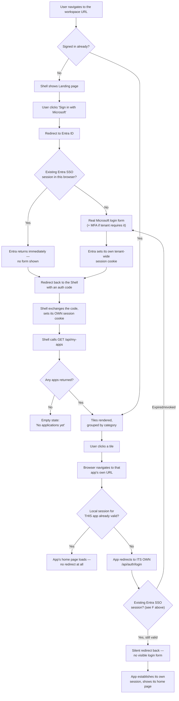
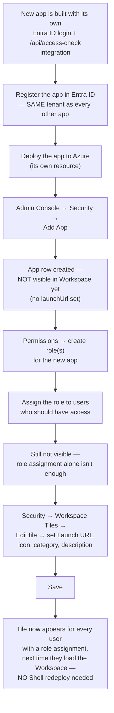
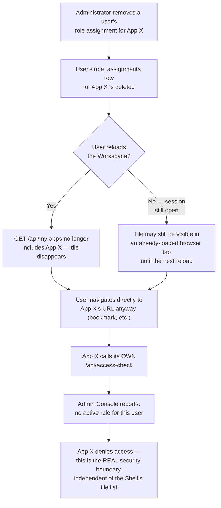
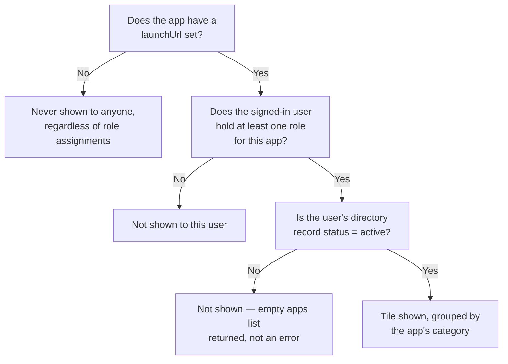
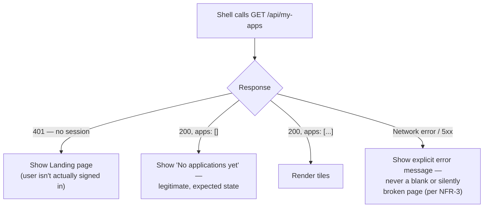

# Digital Workspace — Workflows & Architecture Mapping

This document has two parts: (1) how what was built maps against the
reference architecture picture supplied for this project, box by box, so
it's clear what's a direct match versus a documented gap; and (2) the
actual end-to-end workflows — as diagrams, not prose — for every process a
user or administrator goes through.

## Part 1 — Architecture mapping

Reference architecture: **Digital Workspace Shell → Independent Business
Applications → Shared Services Layer → ERP/Data Foundation.**

```mermaid
flowchart TB
    subgraph L1["1. Digital Workspace Shell"]
        direction LR
        L1a["App shell / portal<br/>✅ BUILT"]
        L1b["SSO (Entra ID)<br/>✅ BUILT"]
        L1c["Role Based Access<br/>✅ BUILT"]
        L1d["Global Navigation<br/>✅ BUILT"]
        L1e["Global Search<br/>⚠️ PARTIAL — filters your own tiles only"]
        L1f["Notifications / My Profile /<br/>Themes & Branding / User Prefs<br/>❌ NOT BUILT"]
    end

    subgraph L2["2. Independent Business Applications"]
        direction LR
        L2a["Field Service Schedule<br/>✅ Field Service Calendar"]
        L2b["Admin / Configuration<br/>✅ Admin Console"]
        L2c["Case Mgmt / Sales-Orders /<br/>Customer Assets / Reporting<br/>❌ DON'T EXIST YET"]
    end

    subgraph L3["3. Shared Services Layer"]
        direction LR
        L3a["Auth & Identity<br/>✅ BUILT — Entra ID + entitlement API"]
        L3b["Data Services<br/>⚠️ PARTIAL — each app has its own DB,<br/>no shared data-access layer"]
        L3c["API Gateway / Business Rules &<br/>Workflows / Notifications /<br/>Search Service<br/>❌ NOT BUILT"]
        L3d["Service Discovery / Centralized<br/>Logging / Monitoring / Security &<br/>Compliance / Secrets Mgmt<br/>❌ NOT BUILT as a unified layer"]
    end

    subgraph L4["4. ERP / Data Foundation"]
        direction LR
        L4a["Dynamics 365 F&O<br/>✅ Already integrated (pre-existing)"]
        L4b["Microsoft Graph<br/>✅ Already integrated (pre-existing)"]
        L4c["Dataverse / Azure SQL /<br/>External Systems<br/>❌ N/A — this workspace uses<br/>Azure Postgres, not these"]
    end

    L1 --> L2 --> L3 --> L4
```

### What this means in practice

- **What you can rely on today:** sign in once, see only your apps, open
  any of them without a second login. That's the whole top-of-picture
  promise, delivered and verified (see `TECHNICAL_DESIGN.md` §9).
- **What's a real, called-out gap, not an oversight:** there is no API
  gateway, no shared workflow/notification/search engine, and no unified
  logging/monitoring/secrets platform. Every app still talks to its own
  database and exposes its own API directly. If any of the Shared Services
  Layer boxes are needed for a later phase, they're additive on top of what
  exists — nothing built here would need to be redone.
- **The app tiles in the picture are illustrative**, not literal — "Case
  Management," "Sales/Orders," and "Customer Assets" don't exist as
  applications in this workspace. The three real apps are Field Service
  Calendar, Production Calendar, and the Admin Console.

## Part 2 — End-to-end workflows

### 2.1 First-time user sign-in and app launch

### 2.2 Administrator onboards a new application

(Full step-by-step detail lives in `ADDING_NEW_APPS.md` — this is the same
process as a flow.)

### 2.3 Revoking a user's access

### 2.4 Tile visibility decision (what determines whether a tile shows)

### 2.5 What happens if `/api/my-apps` fails

